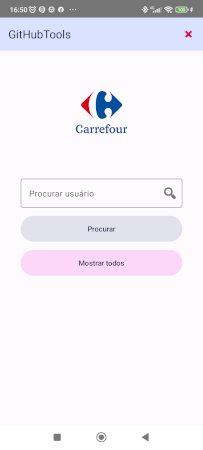
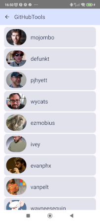

# Desafio Android

- Padrão Clean
- Arquitetura MVI
- DI koin
- Gradle Kotlin DSL
- Coil
- Jetpack Compose
- Retrofit
- Interceptor
- Material3
- SplashScreen
-

  
Instruçoes:
- acesse https://github.com/settings/personal-access-tokens/new
- crie um token para acesso simples e copie o mesmo
- substitua o token no arquivo gradle.properties
- rode o projeto  
  
